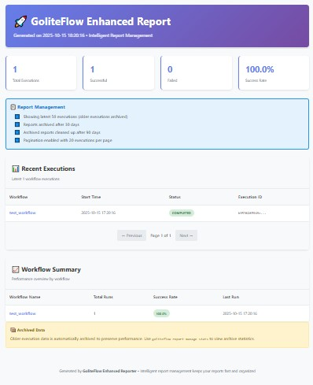

# GoliteFlow

[](https://github.com/sintakaridina/goliteflow/actions)
[](https://golang.org/)
[](https://opensource.org/licenses/MIT)
[](https://goreportcard.com/report/github.com/sintakaridina/goliteflow)
[](https://github.com/sintakaridina/goliteflow/releases)
[](https://github.com/sintakaridina/goliteflow/stargazers)
[](https://github.com/sintakaridina/goliteflow/network)

A lightweight workflow scheduler and task orchestrator designed for monolithic or small applications. GoliteFlow executes tasks/workflows defined in YAML files with retry logic, conditional execution, monitoring, and cron-based scheduling.

## Screenshots

### HTML Report Dashboard


_Beautiful HTML reports with execution history, task details, and interactive interface_

### CLI Usage


_Easy-to-use command-line interface for workflow management_

## Quick Start (5 Minutes)

### 1. Installation

```bash
# Install via Go
go get github.com/sintakaridina/goliteflow

# Or download binary
curl -L https://github.com/sintakaridina/goliteflow/releases/latest/download/goliteflow-linux-amd64 -o goliteflow
chmod +x goliteflow
```

### 2. Create Your First Workflow

Create `workflows.yml`:

```yaml
version: "1.0"
workflows:
  - name: daily_backup
    schedule: "0 2 * * *" # Daily at 2 AM
    tasks:
      - id: backup_data
        command: "tar -czf backup.tar.gz /data"
        retry: 3
      - id: upload_backup
        depends_on: ["backup_data"]
        command: "aws s3 cp backup.tar.gz s3://my-bucket/"
        retry: 2
```

### 3. Run Your Workflow

```bash
# Validate configuration
goliteflow validate --config=workflows.yml

# Run once
goliteflow run --config=workflows.yml

# Generate report
goliteflow report --output=report.html
```

### 4. View Results

Open `report.html` in your browser to see execution details, logs, and statistics.

**That's it!** You now have a working workflow scheduler.

## Features

- **YAML-based Configuration**: Define workflows and tasks in simple YAML files
- **Cron Scheduling**: Built-in scheduler using cron syntax for task scheduling
- **Retry Logic**: Configurable retry mechanisms with exponential backoff
- **Task Dependencies**: Define task execution order with dependency management
- **HTML Monitoring**: Generate beautiful HTML reports with execution history
- **Enhanced Reports**: Enterprise-grade report management with automatic rotation and archival
- **CLI Tool**: Command-line interface for running and managing workflows
- **Library Interface**: Use as a Go library in your applications
- **Zero External Dependencies**: No database or web server required
- **Comprehensive Logging**: Built-in logging with zerolog

## Feature Comparison

| Feature                   | GoliteFlow            | Airflow                        | Prefect        | Temporal          |
| ------------------------- | --------------------- | ------------------------------ | -------------- | ----------------- |
| **Setup Complexity**      | ⭐ Simple             | ⭐⭐⭐ Complex                 | ⭐⭐ Medium    | ⭐⭐⭐ Complex    |
| **External Dependencies** | ❌ None               | ✅ Database + Web              | ✅ Database    | ✅ Database + Web |
| **Resource Usage**        | ⭐ Minimal            | ⭐⭐⭐ High                    | ⭐⭐ Medium    | ⭐⭐⭐ High       |
| **YAML Configuration**    | ✅ Native             | ❌ Python                      | ❌ Python      | ❌ Code           |
| **HTML Reports**          | ✅ Built-in           | ❌ External                    | ❌ External    | ❌ External       |
| **CLI Tool**              | ✅ Full-featured      | ⭐ Basic                       | ⭐ Basic       | ⭐ Basic          |
| **Go Integration**        | ✅ Native             | ❌ Python                      | ❌ Python      | ⭐ SDK            |
| **Learning Curve**        | ⭐ Easy               | ⭐⭐⭐ Hard                    | ⭐⭐ Medium    | ⭐⭐⭐ Hard       |
| **Perfect For**           | Small apps, Monoliths | Large teams, Complex workflows | Data pipelines | Microservices     |

**Why GoliteFlow?**

- **Zero setup** - No databases or web servers to configure
- **Lightweight** - Perfect for small applications and monoliths
- **Simple** - YAML configuration, no complex setup
- **Self-contained** - Everything you need in one binary

## Installation

### As a Go Module

```bash
go get github.com/sintakaridina/goliteflow
```

### Download Binary

Download the latest release for your platform:

```bash
# Linux/macOS
curl -L https://github.com/sintakaridina/goliteflow/releases/latest/download/goliteflow-linux-amd64 -o goliteflow
chmod +x goliteflow

# Windows
curl -L https://github.com/sintakaridina/goliteflow/releases/latest/download/goliteflow-windows-amd64.exe -o goliteflow.exe

# macOS (Apple Silicon)
curl -L https://github.com/sintakaridina/goliteflow/releases/latest/download/goliteflow-darwin-arm64 -o goliteflow
chmod +x goliteflow
```

### Docker

```bash
docker pull sintakaridina/goliteflow:latest
docker run -v $(pwd):/workflows sintakaridina/goliteflow:latest run --config=/workflows/workflows.yml
```

## Usage

### Library Usage

```go
package main

import (
    "log"
    "github.com/sintakaridina/goliteflow"
)

func main() {
    // Simple usage
    err := goliteflow.Run("workflows.yml")
    if err != nil {
        log.Fatal(err)
    }

    // With report generation
    err = goliteflow.RunWithReport("workflows.yml", "report.html")
    if err != nil {
        log.Fatal(err)
    }
}
```

### CLI Usage

```bash
# Validate workflow configuration
goliteflow validate --config=workflows.yml

# Run workflow once
goliteflow run --config=workflows.yml

# Run as daemon (continuous scheduling)
goliteflow run --config=workflows.yml --daemon

# Generate HTML report
goliteflow report --output=report.html

# Show help
goliteflow --help
```

## Configuration

### Workflow Configuration

```yaml
version: "1.0"
workflows:
  - name: data_pipeline
    schedule: "0 */6 * * *" # Every 6 hours
    tasks:
      - id: fetch_data
        command: "curl -s https://api.example.com/data > data.json"
        retry: 3
        timeout: "5m"
      - id: process_data
        depends_on: ["fetch_data"]
        command: "python process.py data.json"
        retry: 2
        timeout: "10m"
      - id: send_notification
        depends_on: ["process_data"]
        command: "curl -X POST https://hooks.slack.com/..."
        retry: 1
```

### Task Configuration

| Field        | Type    | Required | Description                           |
| ------------ | ------- | -------- | ------------------------------------- |
| `id`         | string  | ✅       | Unique task identifier                |
| `command`    | string  | ✅       | Command to execute                    |
| `depends_on` | array   | ❌       | List of task IDs this task depends on |
| `retry`      | integer | ❌       | Number of retry attempts (default: 0) |
| `timeout`    | string  | ❌       | Task timeout (e.g., "5m", "1h")       |
| `env`        | object  | ❌       | Environment variables                 |

## Examples

### Data Processing Pipeline

```yaml
version: "1.0"
workflows:
  - name: daily_data_processing
    schedule: "0 1 * * *" # Daily at 1 AM
    tasks:
      - id: download_data
        command: "wget -O data.csv https://example.com/data.csv"
        retry: 3
      - id: validate_data
        depends_on: ["download_data"]
        command: "python validate.py data.csv"
        retry: 2
      - id: transform_data
        depends_on: ["validate_data"]
        command: "python transform.py data.csv"
        retry: 2
      - id: load_data
        depends_on: ["transform_data"]
        command: "python load.py transformed_data.csv"
        retry: 3
      - id: cleanup
        depends_on: ["load_data"]
        command: "rm -f data.csv transformed_data.csv"
        retry: 1
```

### Backup Workflow

```yaml
version: "1.0"
workflows:
  - name: weekly_backup
    schedule: "0 2 * * 0" # Every Sunday at 2 AM
    tasks:
      - id: create_backup
        command: "tar -czf backup-$(date +%Y%m%d).tar.gz /important/data"
        retry: 2
        timeout: "2h"
      - id: upload_to_s3
        depends_on: ["create_backup"]
        command: "aws s3 cp backup-*.tar.gz s3://my-backup-bucket/"
        retry: 3
        env:
          AWS_ACCESS_KEY_ID: "your-key"
          AWS_SECRET_ACCESS_KEY: "your-secret"
      - id: verify_backup
        depends_on: ["upload_to_s3"]
        command: "aws s3 ls s3://my-backup-bucket/ | grep backup-"
        retry: 2
      - id: cleanup_local
        depends_on: ["verify_backup"]
        command: "rm -f backup-*.tar.gz"
        retry: 1
```

## Enhanced Report Management

GoliteFlow provides enterprise-grade report management for production deployments, addressing the common issue of unbounded HTML report growth over time.

### Problem: Report Scaling Issues

In production environments running 24/7 for months or years, traditional HTML reports can grow to gigabytes in size, causing:

- Slow loading times
- High memory usage
- Poor user experience
- Storage concerns

### Solution: Intelligent Report Management

The enhanced report system provides:

- **🔄 Automatic Rotation**: Limits main report to configurable number of recent executions
- **📦 Monthly Archival**: Archives older execution data organized by month
- **🧹 Automatic Cleanup**: Removes very old archived data based on retention policies
- **⚡ Fast Performance**: Constant loading time regardless of execution history
- **📊 Rich Analytics**: Comprehensive statistics and workflow summaries

### Usage Examples

```bash
# Generate enhanced report (default settings)
goliteflow report-enhanced -o report.html

# Custom configuration for high-volume production
goliteflow report-enhanced \
  --max-executions 25 \
  --archive-after 7 \
  --cleanup-after 30 \
  --output production_report.html

# Report management operations
goliteflow report-manage stats          # View statistics
goliteflow report-manage archive        # Archive old reports
goliteflow report-manage cleanup        # Clean up old archives
```

### Configuration Options

| Option             | Default | Description                          |
| ------------------ | ------- | ------------------------------------ |
| `--max-executions` | 50      | Max executions in main report        |
| `--archive-after`  | 30      | Archive reports after N days         |
| `--cleanup-after`  | 90      | Delete archived reports after N days |
| `--page-size`      | 20      | Executions per page                  |
| `--pagination`     | true    | Enable pagination                    |

### Production Deployment

For continuous production deployments, set up automated maintenance:

```bash
# Daily archival (cron job)
0 2 * * * goliteflow report-manage archive

# Weekly cleanup (cron job)
0 3 * * 0 goliteflow report-manage cleanup
```

📖 **Complete Guide**: See [Report Management Documentation](docs/report-management.md) for detailed configuration, troubleshooting, and best practices.

## Development

### Building from Source

```bash
git clone https://github.com/sintakaridina/goliteflow.git
cd goliteflow
go build -o goliteflow cmd/goliteflow/main.go
```

### Running Tests

```bash
go test ./...
```

### Contributing

We welcome contributions! Please see our [Contributing Guidelines](CONTRIBUTING.md) for details.

1. Fork the repository
2. Create a feature branch (`git checkout -b feature/amazing-feature`)
3. Commit your changes (`git commit -m 'Add amazing feature'`)
4. Push to the branch (`git push origin feature/amazing-feature`)
5. Open a Pull Request

## Community

### Support Channels

- **GitHub Issues**: [Report bugs and request features](https://github.com/sintakaridina/goliteflow/issues)
- **GitHub Discussions**: [Ask questions and share ideas](https://github.com/sintakaridina/goliteflow/discussions)
- **Documentation**: [Complete documentation](https://sintakaridina.github.io/goliteflow/)

### Contributing

We welcome contributions from the community! Here's how you can help:

- **Bug Reports**: Found a bug? Please report it on [GitHub Issues](https://github.com/sintakaridina/goliteflow/issues)
- **Feature Requests**: Have an idea? Share it in [GitHub Discussions](https://github.com/sintakaridina/goliteflow/discussions)
- **Code Contributions**: Submit a pull request following our [Contributing Guidelines](CONTRIBUTING.md)
- **Documentation**: Help improve our documentation
- **Examples**: Share your workflow examples

### Code of Conduct

This project follows the [Contributor Covenant Code of Conduct](CODE_OF_CONDUCT.md). By participating, you agree to uphold this code.

## License

This project is licensed under the MIT License - see the [LICENSE](LICENSE) file for details.

## Acknowledgments

- [robfig/cron](https://github.com/robfig/cron) for cron scheduling
- [rs/zerolog](https://github.com/rs/zerolog) for structured logging
- [spf13/cobra](https://github.com/spf13/cobra) for CLI framework
- [gopkg.in/yaml.v3](https://gopkg.in/yaml.v3) for YAML parsing

## Changelog

See [CHANGELOG.md](CHANGELOG.md) for a list of changes and version history.

---

**Made with ❤️ by [sintakaridina](https://github.com/sintakaridina)**

[](https://github.com/sintakaridina/goliteflow/stargazers)
[](https://github.com/sintakaridina/goliteflow/network)
[](https://github.com/sintakaridina/goliteflow/watchers)
